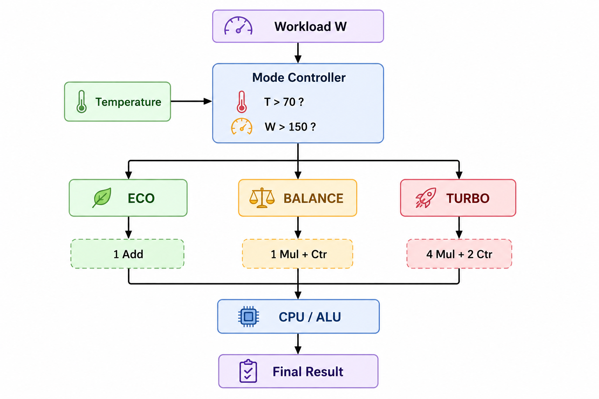
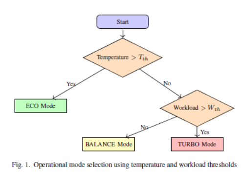
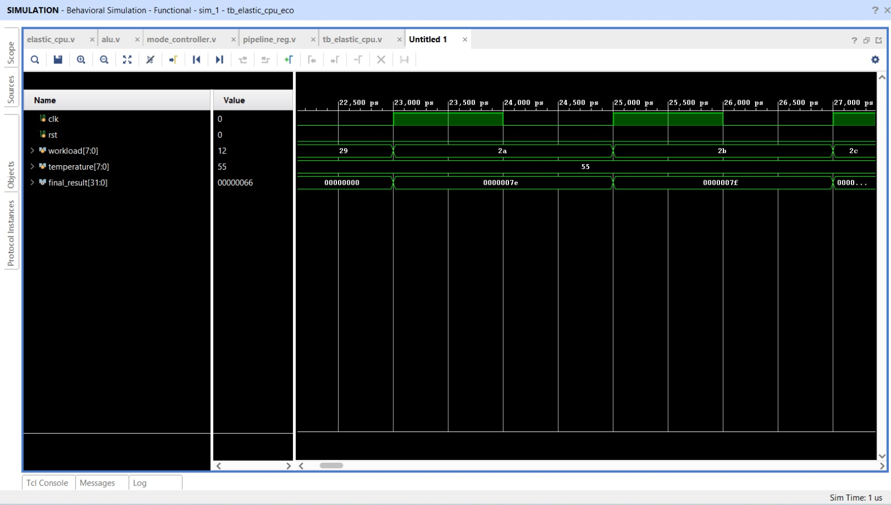
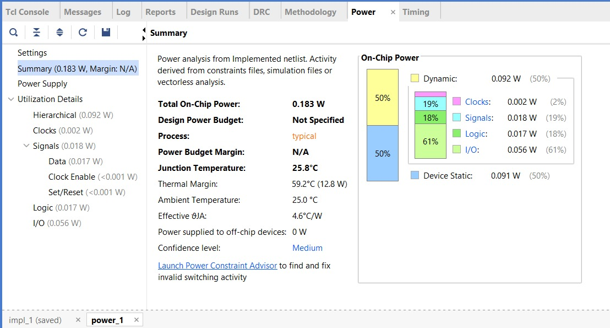
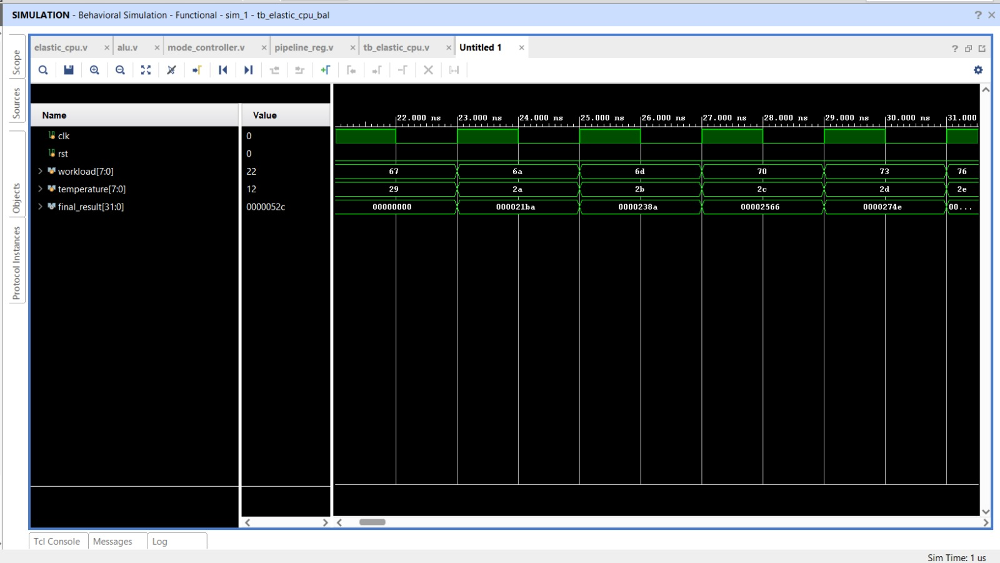
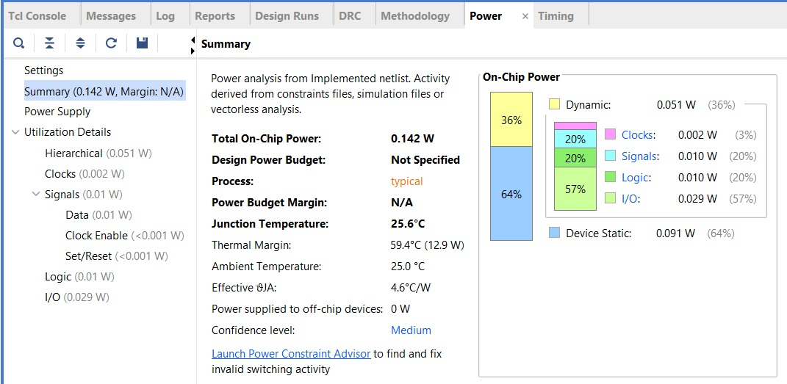
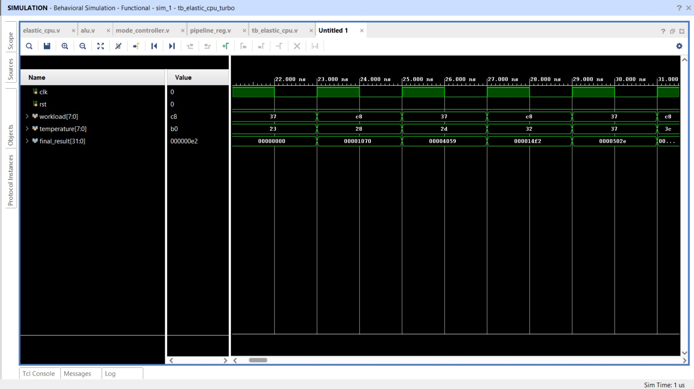
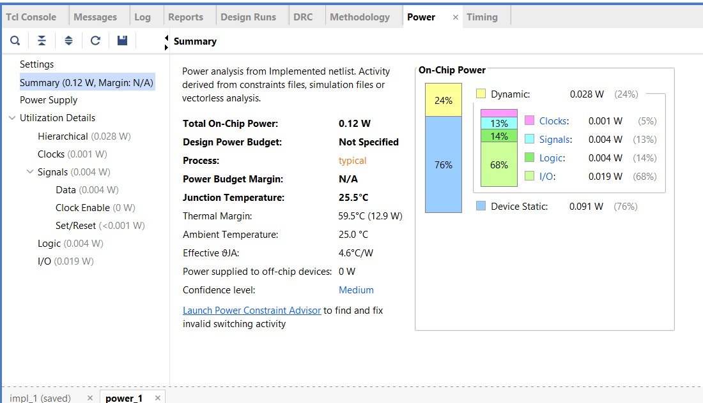
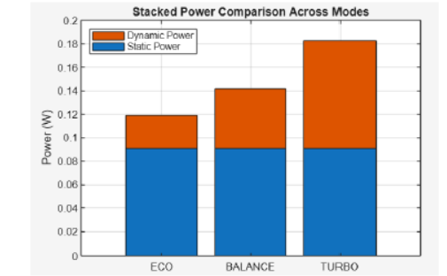
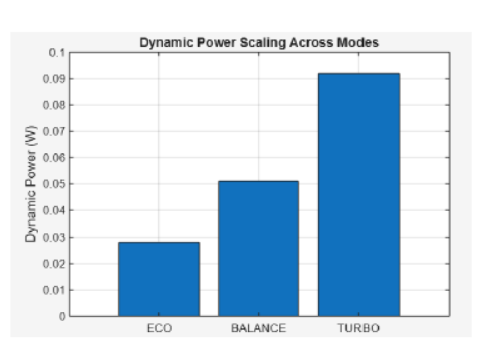

# Power-Elastic CPU

### Runtime Mode-Adaptive Computational Scaling with FPGA-Based Power Validation

A Verilog-based **Power-Elastic CPU architecture** that dynamically adapts its computational resources according to **workload demand and thermal conditions**.

The architecture operates in three runtime modes:

* **ECO** — minimum computational activity
* **BALANCE** — moderate computational activity
* **TURBO** — maximum computational activity

The design was evaluated using **Vivado simulation, SAIF-based switching activity analysis, and FPGA implementation-level power estimation**.

---

## 📌 Project Overview

Conventional processor architectures generally keep their computational resources structurally available even when workload demand is low. This can result in unnecessary switching activity and increased dynamic power.

This project introduces a lightweight hardware-level approach in which arithmetic resources are selectively activated according to runtime workload and temperature conditions.

The architecture maintains a constant operating voltage and clock frequency while changing the amount of active computational hardware.

---

## 🏗️ Architecture

The Power-Elastic CPU monitors:

* **Workload (W)**
* **Temperature (T)**

A mode controller evaluates these values against predefined thresholds and selects one of three operating modes.



---

## 🔄 Runtime Mode Selection

The mode-selection policy is:

| Condition              | Operating Mode |
| ---------------------- | -------------- |
| `T > 70`               | ECO            |
| `T ≤ 70` and `W > 150` | TURBO          |
| `T ≤ 70` and `W ≤ 150` | BALANCE        |

The thermal condition is evaluated first. When the temperature exceeds the thermal threshold, the system enters ECO mode to reduce computational activity.



---

## ⚙️ Operating Modes

### ECO Mode

ECO mode provides the lowest computational activity.

**Active resources:**

* 1 Addition unit

**Dynamic Power:** 0.028 W
**Total On-Chip Power:** 0.120 W





---

### BALANCE Mode

BALANCE mode provides an intermediate level of computational activity.

**Active resources:**

* 1 Multiplier
* 1 Counter

**Dynamic Power:** 0.051 W
**Total On-Chip Power:** 0.142 W





---

### TURBO Mode

TURBO mode enables the highest computational capacity through parallel arithmetic resources.

**Active resources:**

* 4 Multipliers
* 2 Counters

**Dynamic Power:** 0.092 W
**Total On-Chip Power:** 0.183 W





---

## 📊 Power Results

The implemented design produced the following power results:

| Mode    | Static Power | Dynamic Power | Total Power |
| ------- | -----------: | ------------: | ----------: |
| ECO     |      0.091 W |       0.028 W |     0.120 W |
| BALANCE |      0.091 W |       0.051 W |     0.142 W |
| TURBO   |      0.091 W |       0.092 W |     0.183 W |

Static power remains approximately constant, while dynamic power increases with the number of active computational resources.



---

## 📈 Dynamic Power Scaling

Dynamic power increases from **0.028 W in ECO mode** to **0.092 W in TURBO mode**.

This corresponds to a:

**228.57% ECO-to-TURBO dynamic power increase**



---

## 🧪 Simulation

Three dedicated simulation scenarios were used to evaluate the operating modes:

```text
ECO
 ↓
High-temperature condition
 ↓
Reduced computational activity
```

```text
BALANCE
 ↓
Moderate workload
 ↓
Intermediate computational activity
```

```text
TURBO
 ↓
High workload under safe thermal conditions
 ↓
Maximum computational activity
```

The waveforms demonstrate the corresponding workload, temperature, clock, reset, and final-result behavior for each operating condition.

---

## 🔬 Power Analysis Methodology

The power evaluation follows this process:

```text
Verilog RTL
     ↓
Behavioral Simulation
     ↓
Switching Activity Capture
     ↓
SAIF Generation
     ↓
Implemented Netlist
     ↓
SAIF Back-Annotation
     ↓
Vivado Power Analysis
     ↓
Dynamic + Static + Total Power
```

The switching activity was captured separately for ECO, BALANCE, and TURBO operating conditions and used for implementation-level power estimation.

---

## 🧮 Power Scaling Principle

Dynamic CMOS power can be represented as:

```text
Pdynamic = α × CL × V² × f
```

where:

* `α` = switching activity
* `CL` = load capacitance
* `V` = supply voltage
* `f` = operating frequency

In this architecture, voltage and frequency remain constant.

Therefore, computational elasticity is achieved primarily by changing the active hardware resources and consequently the switching activity.

---

## 🛠️ Tools & Technologies

* **HDL:** Verilog
* **FPGA:** Xilinx Artix-7
* **Device:** XC7A100T-CSG324-1
* **Simulation:** Vivado Simulator
* **Implementation:** Xilinx Vivado
* **Power Analysis:** Vivado Power Analysis
* **Switching Activity:** SAIF

---

## 📁 Repository Structure

```text
power-elastic-cpu/
│
├── rtl/
│   └── Verilog RTL modules
│
├── simulation/
│   └── Testbenches
│
├── constraints/
│   └── FPGA constraints
│
├── saif/
│   └── Switching activity files
│
├── results/
│   ├── waveforms/
│   └── power/
│
├── docs/
│   ├── architecture.png
│   ├── mode_selection_flowchart.png
│   ├── power_comparison.png
│   └── dynamic_power_scaling.png
│
├── README.md
└── LICENSE
```

---

## 🎯 Key Results

* Three runtime computational modes: **ECO, BALANCE, TURBO**
* Workload- and temperature-based mode selection
* Constant voltage and clock frequency across modes
* Dynamic power increased from **0.028 W to 0.092 W**
* Total on-chip power increased from **0.120 W to 0.183 W**
* **228.57% dynamic power scalability** from ECO to TURBO
* Static power remained approximately **0.091 W**
* SAIF-based switching activity used for power estimation

---

## 🚀 Future Improvements

Potential extensions include:

* Integration of voltage/frequency scaling
* Wider datapaths
* Additional computational modes
* More sophisticated workload prediction
* Hardware implementation on physical FPGA hardware
* Runtime power monitoring and feedback

---

## 👨‍💻 Project

**Power-Elastic CPU**

A hardware research project focused on runtime computational elasticity and power-aware FPGA architectures.
